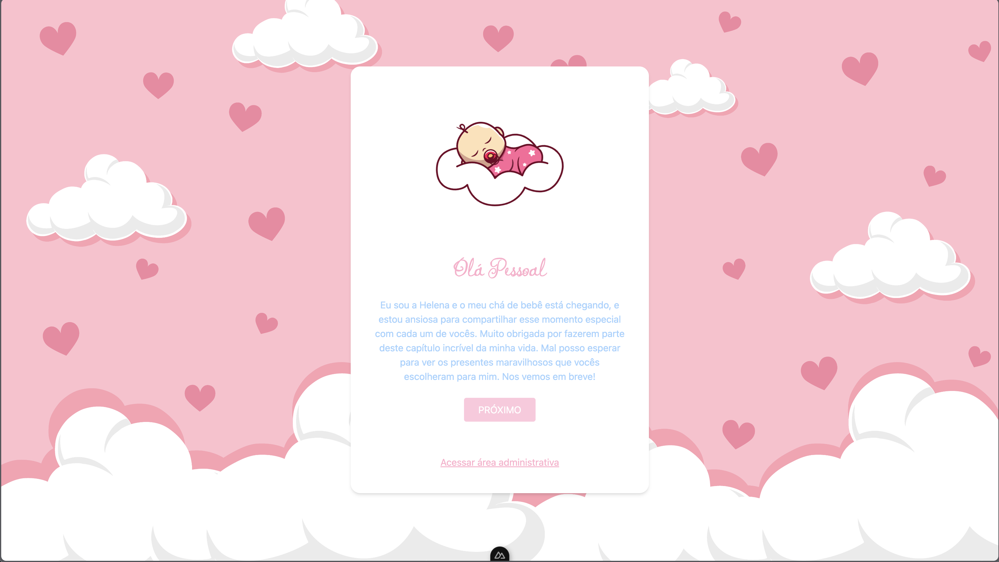
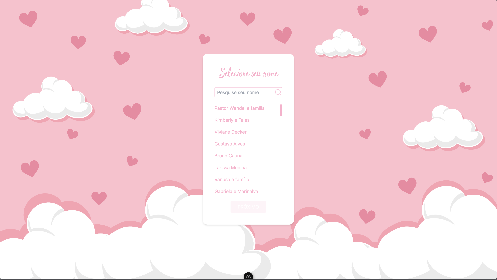
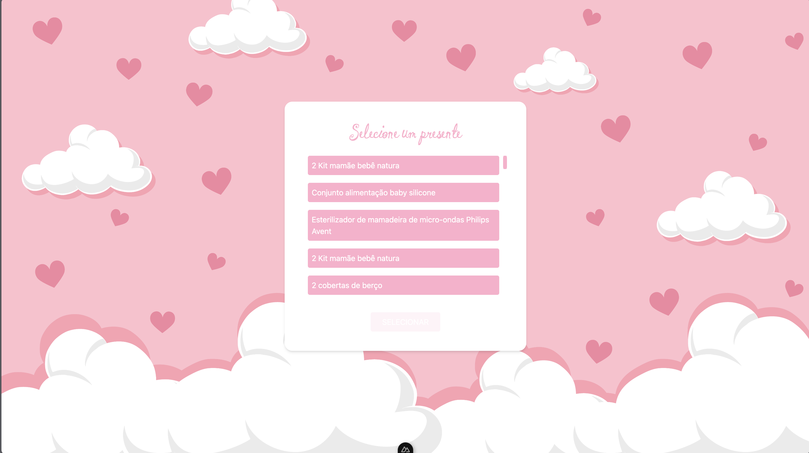
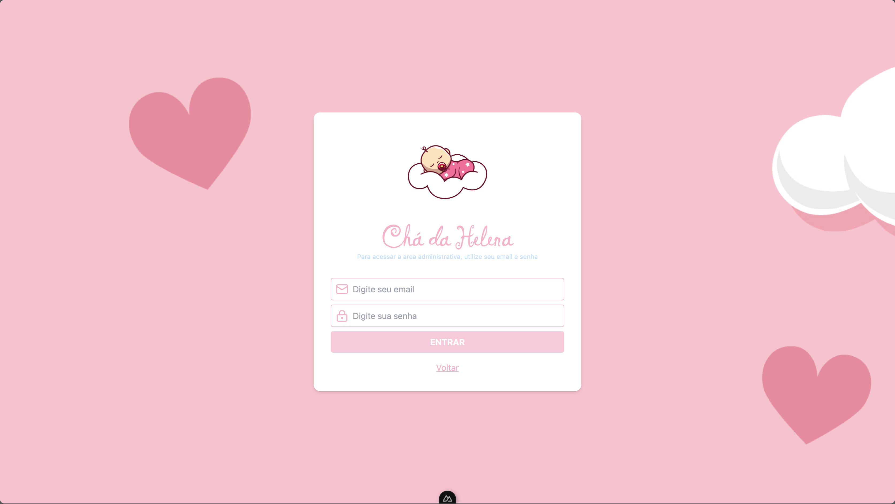
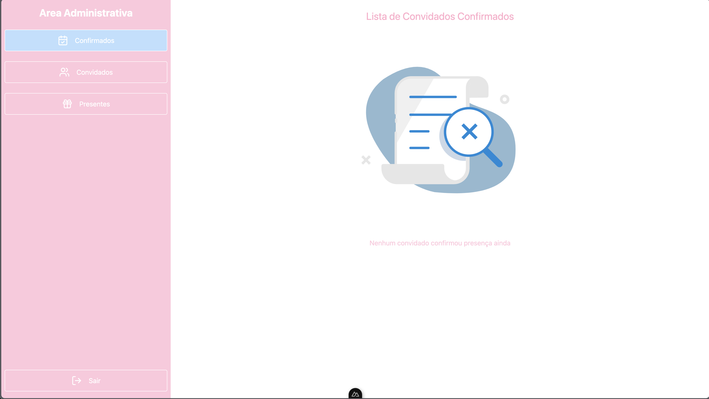
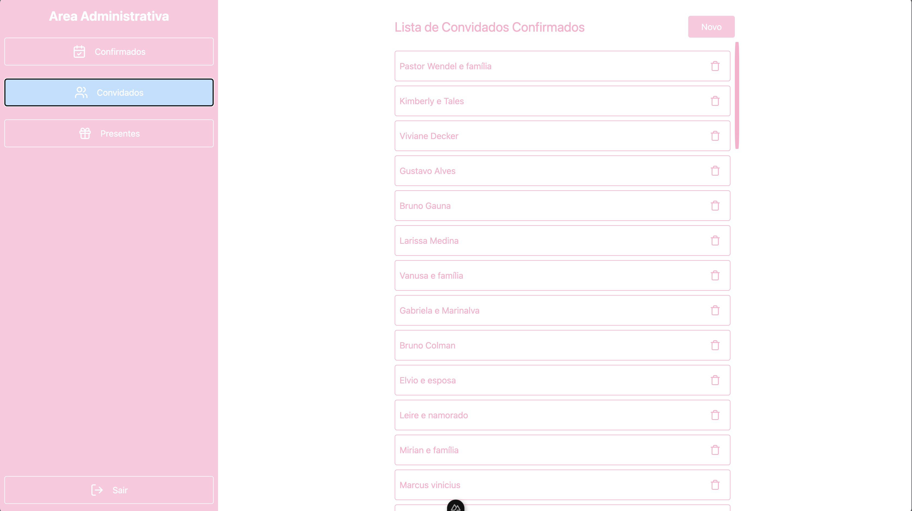
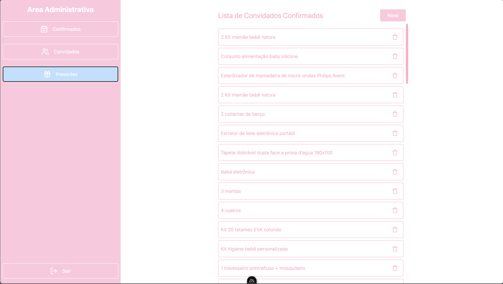

# Chá de Bebe da Helena APP

Aplicação Criada Para meu amigo Vinícius. A aplicação vai ser para os convidados do chá de Bebe da Helena, filha dele, poderem marcar presença na festa, e tambem poderem escolher algum presente da lista, para presentar a Helena. Com a confirmação os Papais da Helena, podem ver quem vai a festa, qual presente vai levar, evitando repetição de presentes, e tendo controle sobre a quantidade de convidados.

## Tecnologias
- Nuxt JS
- Tailwind CSS
- Pinia
- Typescript
- Supabase
- Animate CSS
- Google Fonts


## Funcionalidades
- Marcar presença no chá da Helena
- Listagem de Usuários com base em uma tabela Guests no Supabase
- Listagem de Presentes com base na tabela Gifts no supabase
- Área Administrativa, usando autenticação do supabase, para papai e mamãe cadastrar presentes ou convidados, alem de deletar.


## Capturas de Tela









## Setup

Make sure to install the dependencies:

```bash
# npm
npm install

# pnpm
pnpm install

# yarn
yarn install

# bun
bun install
```

## Development Server

Start the development server on `http://localhost:3000`:

```bash
# npm
npm run dev

# pnpm
pnpm run dev

# yarn
yarn dev

# bun
bun run dev
```

## Production

Build the application for production:

```bash
# npm
npm run build

# pnpm
pnpm run build

# yarn
yarn build

# bun
bun run build
```

Locally preview production build:

```bash
# npm
npm run preview

# pnpm
pnpm run preview

# yarn
yarn preview

# bun
bun run preview
```

Check out the [deployment documentation](https://nuxt.com/docs/getting-started/deployment) for more information.
